# WALMART SALES ANALYSIS

## OVERVIEW
Walmart is a multinational retail corporation that operates a chain of hypermarkets, discount department stores, and grocery stores. Walmart have few physical stores in Myanmar, 
but some of its products are available in the country through local merchants who import them from other countries. Walmart products are mainly sold in City Mart, 
a leading supermarket chain in Myanmar that operates in 20 cities and towns. Walmart’s presence in Myanmar is limited by several factors, such as the political and economic situation, 
the lack of infrastructure, the competition from other retailers, and the consumer preferences. Walmart has not expressed any plans to dominate the Myanmar market, 
but it may consider doing so in the future if the conditions improve and the demand increases. Walmart operates in 20 other countries, including China, India, Japan, and Thailand.

The aim of this project is to explore Walmart sales data in order to understand the top performing product lines, branches, cities and  as well as sales trend of different products and 
customer type behaviour. The aim is to study how sakes strategies can be improved and optimized. The following are the major problems to be analysed:
- The top selling products and the least selling products.
- The revenue made  from each city.
- The profit made from each city.
- The revenue made from each month.
- The total sales made  from each month.
- The customers type who patronise more.
- The gender based revenue.
- The revenue made from payment methods.

## SKLLS DEMONSTRATED
The following skillls are demonstrated :
- Analytical skills.
- Predictive skills.
- Creative thinking.
- Excel.
- Data transformation.
- Tableau for visualization.

## DATA SOURCING
This data is sourced from www.Kaggle.com. Its is a csv file. It has 1000 rows and 17 columns. The data covered a three month period( Januar-March, 2019) of sales by Walmart Inc in
Myanmar, Asia. The stores are located at three different cities in Myanmar, namely: Mandalay, Nay Pyi Taw, Yangon.

## DATA TRANSFORMATION

This is a clean data. However, other columns were generated  from the data like the cost of goods(COGS), which was  the multiplication of unit price column by the quantity column. 
Also, the total  revenue from sales was generated(Total Column)  by adding COGS and Vat. Vat was included into COGS and passes to customers.

## ANALYSIS AND VISUALIZATION

### The Revenue for the period was  $322,970.

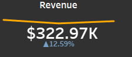

### The Total profit was $15,380.

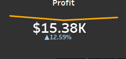

### The profit margin was 4.76%.

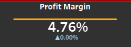

### The total orders were 1,000.

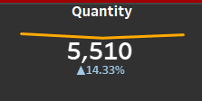

### The total of 5,510 items were sold.

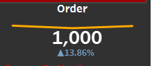

### The top selling products and the least selling products.

Food and beverages, Sports and travels and Electronic accessories made the top three selling products with $56.1k, $55.1k and $54.3k respectively, and the bottom three selling products from the charts are: home and lifestyle, fashion accessory and health and beauty with $54.3k, $53.9k, $49.2k respectively.

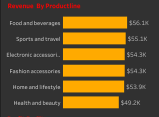

### The Revenue Made From Each city

Naypyyitaw generated more revenue $110,569k, followed by Yangon $106,200k then Mndalay $106,198k in that order. 

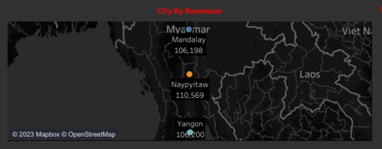

### The Profit Made From Each city

Naypyyitaw stores generated the highest profit of $5.3k,Yangon and Mandalay tied by generating equal amount of profit in the period under consideration

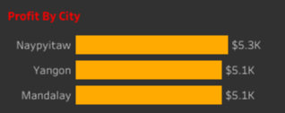

### Revenue made fom Each Month

More revenue was made in January $116.3, followed by March $109.5 and then February $97.2 in that order.

### Sales by Month

Consequently more quantity were sold in January  1.97k, March 1.89k and February 1.65k respectively.

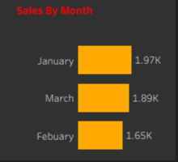

### Revenue by Payment

Over a third of the payment was cash $112k , followed by e-wallet $110k and lastly by credit card $102k.

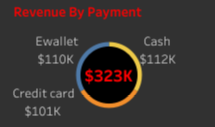

### Revenue by Gender

The revenue made from the female gender was $168k and the male gender was $155k this shows that mode gender patronage are high since the difference between the revenue generated are very close

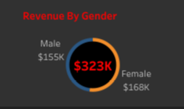

Profit by Customer Type 

50,2% of the profit made came from the members who probably has a subcription to one or more of their products, while 49.8% of the profit were made from sales to visitors.  

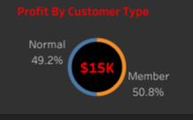

## Conclusions And Recommendations

- Conduct a detailed cost analysis to identify areas where costs can be reduced without compromising product quality or customer experience.
 Negotiate better deals with suppliers to lower the cost of goods sold (COGS). Optimize inventory management to reduce carrying costs.

- Reevaluate your pricing strategy. Consider whether you can increase prices without losing a significant number of customers. Implement dynamic pricing if applicable. Offer bundled packages to increase the average order value.

- Segment your customer base to identify high-value customers who are more profitable. Implement personalized marketing and product recommendations to increase customer retention and cross-selling.

- Streamline your supply chain to reduce shipping and fulfillment costs. Explore options like dropshipping or outsourcing to lower operational expenses.

- Invest in data analytics and business intelligence tools to gain deeper insights into customer behavior, sales trends, and cost structures. Use data to make informed decisions about inventory, marketing, and product offerings.

- Diversify your product range to attract new customer segments and increase cross-selling opportunities. Consider private-label products with higher profit margins

- Focus on customer retention to reduce customer acquisition costs. Implement a loyalty program to incentivize repeat purchases.

- Optimize your marketing campaigns to ensure a higher return on investment (ROI). Shift budget towards high-performing marketing channels and campaigns.

- Review your advertising spend and allocate resources to digital advertising channels with a proven track record of generating sales Continuous Improvement:

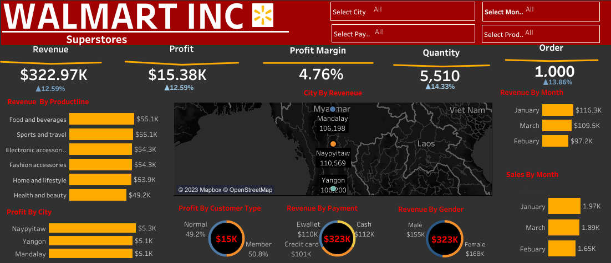

## Thank you

