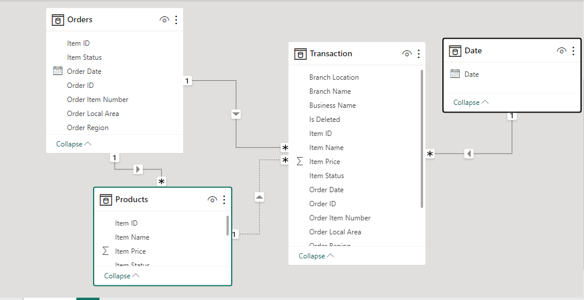

# WALMART INC SALES DATA ANALYSIS

## Introduction

Walmart is a multinational retail corporation that operates a chain of hypermarkets, discount department stores, and grocery stores. Walmart have few physical stores in Myanmar, but some of its products are available in the country through local merchants who import them from other countries. Walmart products are mainly sold in City Mart, a leading supermarket chain in Myanmar that operates in 20 cities and towns. Walmart’s presence in Myanmar is limited by several factors, such as the political and economic situation, the lack of infrastructure, the competition from other retailers, and the consumer preferences. Walmart has not expressed any plans to dominate the Myanmar market, but it may consider doing so in the future if the conditions improve and the demand increases. Walmart operates in 20 other countries, including China, India, Japan, and Thailand.

## Problem Statement

The aim of this project is to explore Walmart sales data in order to understand the top performing product lines, branches, cities and  as well as sales trend of different products and  customer type behaviour. The aim is to study how sakes strategies can be improved and optimized. The following are the major problems to be analysed:
- The top selling products and the least selling products.
- The revenue made  from each city.
- The profit made from each city.
- The revenue made from each month.
- The total sales made  from each month.
- The customers type who patronise more.
- The gender based revenue.
- The revenue made from payment methods.

## Skill demonstrated

The following skillls are demonstrated :
- Analytical skills.
- Predictive skills.
- Creative thinking.
- Excel.
- Data transformation.
- Tableau for visualization.

## Data Sourcing

This data is sourced from www.Kaggle.com. Its is a csv file. It has 1000 rows and 17 columns. The data covered a three month period( Januar-March, 2019) of sales by Walmart Inc in Myanmar, Asia. The stores are located at three different cities in Myanmar, namely: Mandalay, Nay Pyi Taw, Yangon.

## Data Transformation
This is a clean data. However, other columns were generated  from the data like the cost of goods(COGS), which was  the multiplication of unit price column by the quantity column. Also, the total  revenue from sales was generated(Total Column)  by adding COGS and Vat. Vat was included into COGS and passes to customers.

## Data Modelling

Having these four tables necessitate data modelling. Relationships was established among the four tables. The star schema was used and the primary table is the transaction table. Duplicate was removed immediately from the orders table and products table to eleminate many to many relationship and its ambiguities. Interestingly as expected, automatically one to many relationships were established between order table and products tables with the transaction table using their primary keys; Order id, Product Id and subsequently, a one to many relationship was established between the date table and the sales table using the date column.

## Insights And Visualization.

Here  are few discoveries from the analysis; 

### The Revenue for the period was  $322,970.

### The Total profit was $15,380.

### The profit margin was 4.76%.

### The total customers were 1,000.

### The total of 5,510 items were sold.

## Conclusion And Recommendation

- Conduct a detailed cost analysis to identify areas where costs can be reduced without compromising product quality or customer experience.
Negotiate better deals with suppliers to lower the cost of goods sold (COGS).
Optimize inventory management to reduce carrying costs.

- Reevaluate your pricing strategy. Consider whether you can increase prices without losing a significant number of customers. Implement dynamic pricing if applicable.
Offer bundled packages to increase the average order value.

- Segment your customer base to identify high-value customers who are more profitable.
Implement personalized marketing and product recommendations to increase customer retention and cross-selling.

- Streamline your supply chain to reduce shipping and fulfillment costs.
Explore options like dropshipping or outsourcing to lower operational expenses.

- Invest in data analytics and business intelligence tools to gain deeper insights into customer behavior, sales trends, and cost structures.
Use data to make informed decisions about inventory, marketing, and product offerings.

- Diversify your product range to attract new customer segments and increase cross-selling opportunities.
Consider private-label products with higher profit margins.

- Focus on customer retention to reduce customer acquisition costs.
Implement a loyalty program to incentivize repeat purchases.

- Optimize your marketing campaigns to ensure a higher return on investment (ROI).
Shift budget towards high-performing marketing channels and campaigns.

- Review your advertising spend and allocate resources to digital advertising channels with a proven track record of generating sales.
Continuous Improvement:

### Thank you

